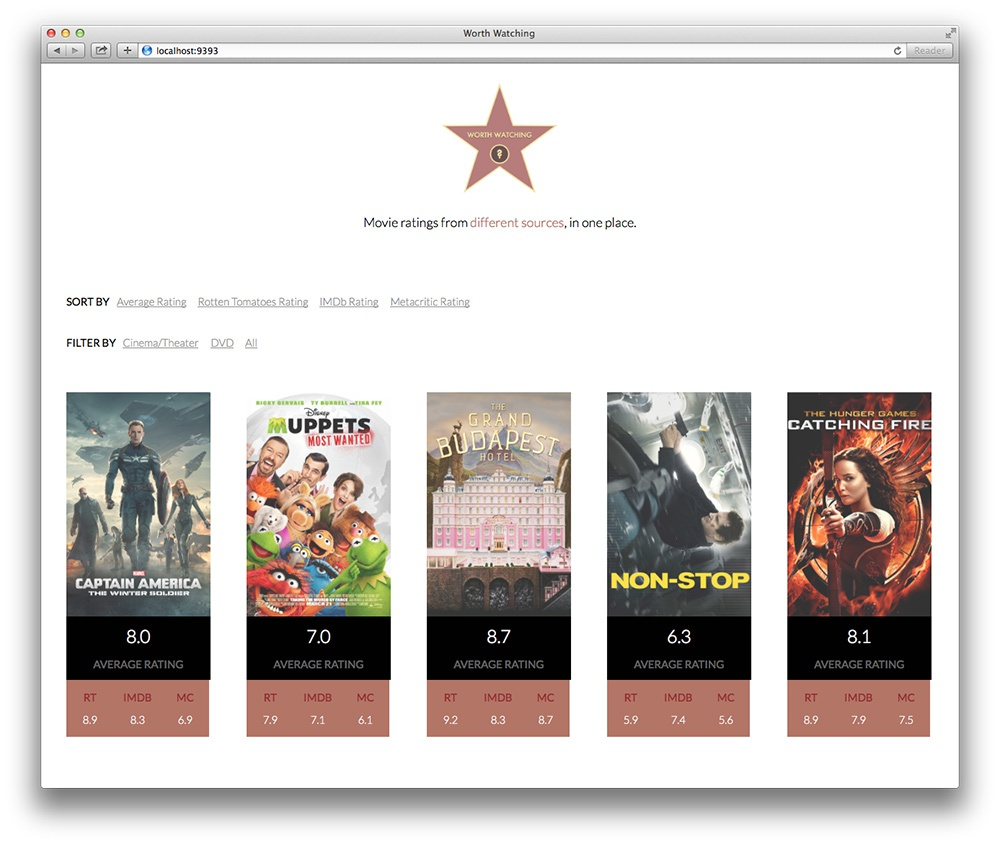
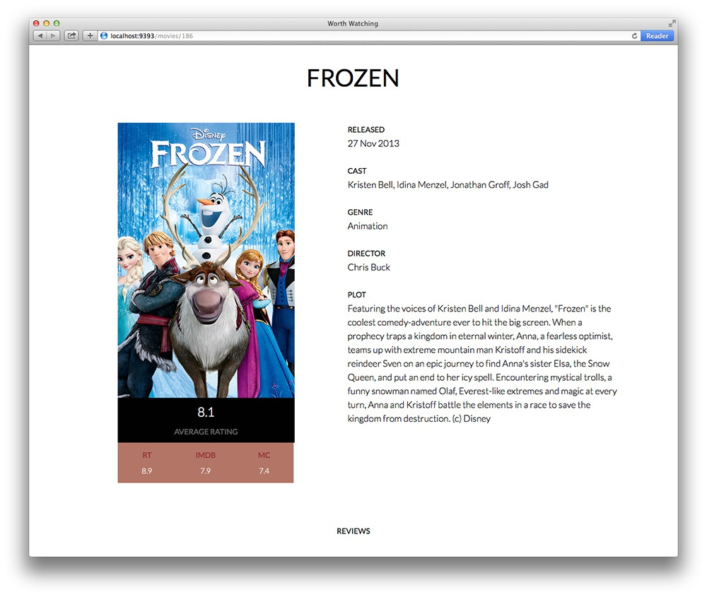

# Worth Watching Web

Worth Watching (web) is a Sinatra app that displays aggregated movie rating information.

It allows you to filter movies by release type (cinema/theater or DVD), and also sort
movies based on their rating source.

Retrieval and aggregation of movie information is facilitated by the [worth_watching ruby gem](http://github.com/alessndro/worth_watching).

### App Structure

There are multiple components to the app.

Firstly, there is the Sinatra app which is backed by a database
containing movie information. As you can see from the main Sinatra app file, there
are only a handful of routes required: one to show an index of all movies, and one
to show the details of an individual movie.

There is a Rake task that performs the job of updating the movie info
database. It uses the [worth_watching gem](http://github.com/alessndro/worth_watching)
to retrieve this movie info. The task then adds the new info to the database and removes
old information. The idea is to use a job scheduler like cron to schedule the Rake task to run weekly and update
the database as new movies are released.

On the front-end side of things, filtering and sorting is facilitated by the excellent [Isotope](http://isotope.metafizzy.co/) JavaScript plugin.

## Configuring the app

You will need a Rotten Tomatoes API key and a TMDB API key in order for the Rake task
to function correctly. Replace the example YAML file in the config directory or edit it
to contain your API keys.

## Updating Movie Information

As mentioned earlier, updating the movie info database is done by running a Rake task
named ``update_movies``.

This rake task (optionally) requires an argument that specifies the number of movies
to retrieve.

Run the task with ``bundle exec rake update_movies[5]``.

Depending on the shell you
are using, you may need to enclose
the rake command in quotes  like so: ``bundle exec "rake update_movies[5]"``.
I noticed that zsh, for example, does not interpret the command correctly unless
quoted.
